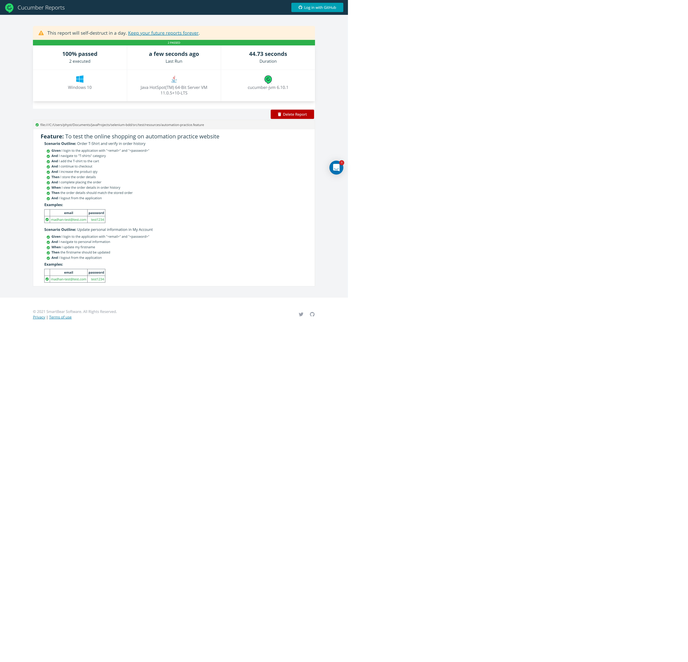

# BDD Automation framework using Selenide and Cucumber

## How to run

It's a gradle based project. You should have `Java8` or greater installed and `chrome browser` installed in your machine

Run the tests using the below command

`gradlew clean cucumber` 

## Execution report

